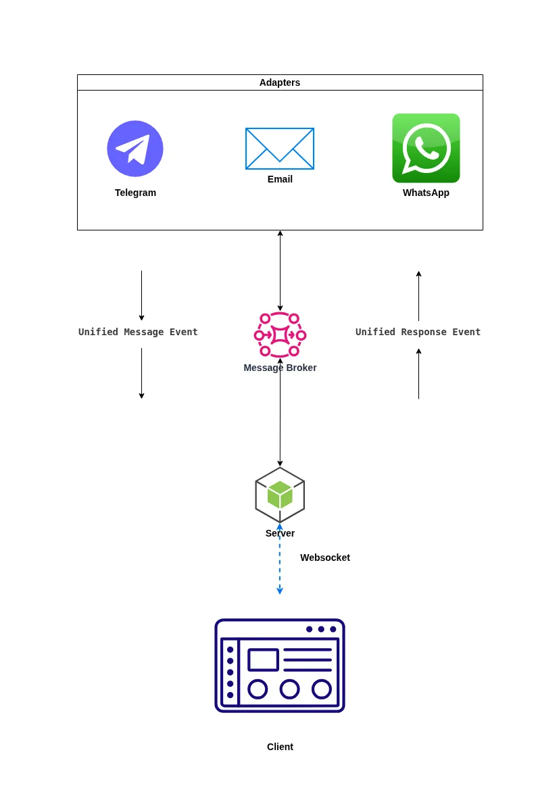

# Technical Design: Unified Inbox Service

A scalable, simple, and robust system to centralize multi-channel communications into a single operator dashboard.

## 1. Main idea in simple language.

The system is built on an Event-Driven Architecture consisting of three decoupled parts connected by a Message Broker and one semi-decoupled part:

- a) server, aka the core
- b) client aka operator's interface
- c) independent channel adapters (one adapter for each info channel, i.e., one for Telegram, one for WhatsApp, one for e-mail, etc.)
- d) event bus, which links all adapters with the operator

More specifically:

1. Event bus is a message queue that ensures asynchronous processing and fault tolerance - even if the Server is down, messages from channels are not lost, they stay in the queue.
1. Adapters are modules/microservices that are only responsible for tunneling incoming data from channel to data bus, and outgoing data from data bus to channel.
1. Server manages the database, listens to the message queue, notifies the operator in real-time, gets the operator's reply, and pushes it into the message queue
1. Client receives messages from the server and replies to them

## 2. Message Flow

### Inbound (Channel -> Operator)

Provider Webhook hits the specific Channel Adapter.

Adapter transforms the payload into a Unified Message Event and pushes it to the Message Broker.

The server consumes data from the Message Broker and pushes the new message to the client in real-time.

### Outbound (Operator -> Channel)

Operator forms a reply. The server transforms the reply into a Unified Response Event and pushes it to the Message Broker.

Adapter consumes the Unified Response Event and translates the reply into the provider-specific format.

## 3. Technical implementation

Channel adapters is a NodeJS application, where each adapter is a spawned worker that serves its respective channel (but it's also possible to spawn multiple workers per channel). If we're expecting a real high load, we also need an "external" load balancer, which would help distribute the load across a few workers for the same channel.

The client can be a template, served by a server, or a complete web application - Next, vanilla React or pure JavaScript.

Server is a NodeJS (pure NodeJS, Nest, Next) application that can serve clients.

Event bus is RabbitMQ, Kafka, or Redis Pub/Sub.

## 4. Key Considerations

### Media Handling:

All attachments (images, PDFs) are intercepted by Adapters, uploaded to storage (e.g., S3 bucket), and replaced with internal URLs.

### Unique identification:

We use provider-supplied message IDs to prevent duplicate processing during retries.

### Scalability:

Adapters can be scaled independently based on the traffic volume of specific channels (spawn more workers).

## 5. Schema

## 6. AI-powered chat feature

My proposal is "Summarize context".

### Description

As we know, generally humans can sharply remember 7±2 items, so if the chat history is longer than 10 messages (especially long and complex ones, and especially if it's a continuation of an old chat) operator will start to lose control.

Summarize context will help the operator, providing a shortened chat history and all needed context. It can be activated manually via clicking the button in the interface, and Chat Summarization will be presented as a modal (for example) or automatically, when the server detects more than 10 messages in one chat.

### Technical

Server loads all data from a specific chat and sends it to a dedicated LLM worker or third-party web API, receiving in response a bulletted summary, which later will be saved as metadata for chat, and can be sent to the client and viewed at any time.
